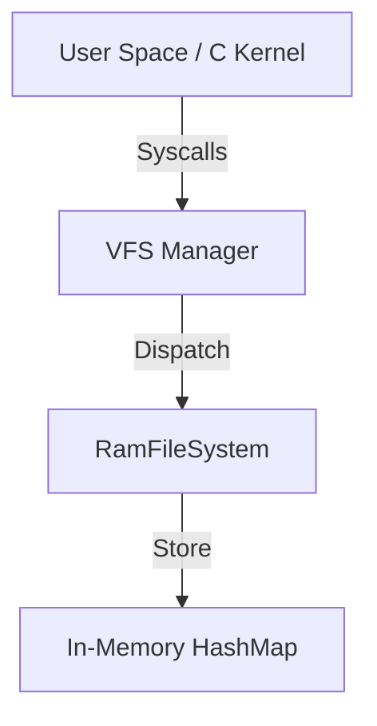

# Filesystem Implementation

## Overview
Implemented a memory-safe Virtual File System (VFS) in Rust, featuring a pluggable driver architecture and an in-memory `RamFS` implementation.

## Implementation

### Core Files
#### [server/native/rust/src/fs.rs](file:///Users/jjsp/Desktop/Cyber%20Lab%20cve%20Vulnarabilities/022UGDW213-Harmony-OS-Next--main/server/native/rust/src/fs.rs)
- **VFS Traits**: `FileSystem` (open, mkdir, list) and `FileHandle` (read, write, close).
- **RamFS**: In-memory filesystem using `HashMap<String, RamFile>`.
- **Global Manager**: Tracks open file descriptors and maps them to handles.
- **FFI**: `rust_fs_*` functions for C kernel integration.

#### [server/native/rust/rust_fs.h](file:///Users/jjsp/Desktop/Cyber%20Lab%20cve%20Vulnarabilities/022UGDW213-Harmony-OS-Next--main/server/native/rust/rust_fs.h)
- C header defining file operations and flags (`O_CREAT`, `O_RDONLY`, etc.).

#### [server/native/tests/test_filesystem.c](file:///Users/jjsp/Desktop/Cyber%20Lab%20cve%20Vulnarabilities/022UGDW213-Harmony-OS-Next--main/server/native/tests/test_filesystem.c)
- Integration test demonstrating file creation, writing, reading, and directory listing.

## Architecture


## Features
- **Pluggable Backends**: The `FileSystem` trait allows adding EXT4/FAT32 drivers later.
- **Memory Safety**: No buffer overflows; thread-safe access to file data (`Arc<Mutex>`).
- **File Descriptors**: Integer-based handle management compatible with POSIX `open`/`read`.

## Build Information
To compile the filesystem stack:
```bash
cd server/native/rust
cargo build --release
```
*Note: Requires Rust toolchain.*

## Next Steps
- Implement `mkdir` support for nested directories.
- Add persistence (save RAM disk to host file).
- Implement standard file permissions.
