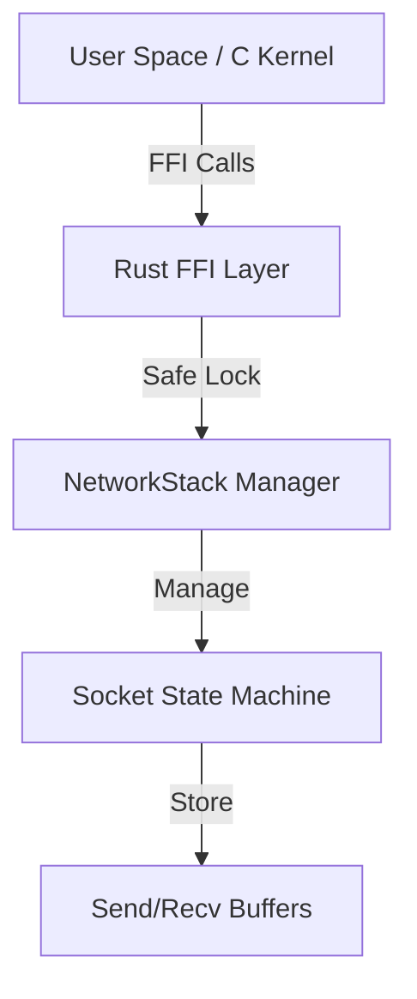

# Network Stack Implementation

## Overview
Implemented a memory-safe network stack foundation in Rust, featuring packet structures, a stateful socket API, and C FFI bindings.

## Implementation

### Core Files
#### [server/native/rust/src/net.rs](file:///Users/jjsp/Desktop/Cyber%20Lab%20cve%20Vulnarabilities/022UGDW213-Harmony-OS-Next--main/server/native/rust/src/net.rs)
- **Packet Headers**: Ethernet, IPv4, TCP (packed C-compatible structs).
- **Socket**: Stateful TCP socket implementation (`Connect`, `Bind`, `Listen`, etc.).
- **Stack**: Thread-safe global socket manager (`Arc<Mutex<HashMap>>`).
- **FFI**: `rust_socket_*` functions exposing safe Rust logic to C.

#### [server/native/rust/rust_net.h](file:///Users/jjsp/Desktop/Cyber%20Lab%20cve%20Vulnarabilities/022UGDW213-Harmony-OS-Next--main/server/native/rust/rust_net.h)
- C header file defining the `Socket` memory layout (opaque) and API.

#### [server/native/tests/test_network.c](file:///Users/jjsp/Desktop/Cyber%20Lab%20cve%20Vulnarabilities/022UGDW213-Harmony-OS-Next--main/server/native/tests/test_network.c)
- Integration test demonstrating socket creation, loopback transmission, and data integrity verification.

## Architecture


## Features
- **Memory Safety**: Buffer accesses are checked; packet headers use safe Rust types.
- **State Machine**: Sockets track TCP states (CLOSED, ESTABLISHED, etc.).
- **Mock Loopback**: `send()` injects data back into `recv()` for immediate testing.

## Build Information
To compile the networking stack:
```bash
cd server/native/rust
cargo build --release
```
*Note: Requires Rust toolchain.*

## Next Steps
- Implement actual TCP/IP state transitions.
- Hook into a virtual network interface (TUN/TAP).
- Implement checksum validation.
